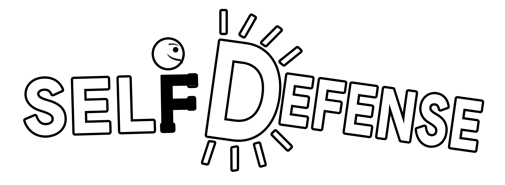

# SelfDefenseKillers

Unity version 2018.4.11f1 (2018.4 LTS)

## Description
Self Defense Killers is an educational VR game which aims to teach self defense techniques particularly to young people by placing them in an environment where they learn to defend against a virtual assaulter by learning fighting techniques.

## My Work
- This was the first game where I programmed majority of it using C#/Unity3D
- Animation State Tree to integrate Mocap animation into the game
- Cleaning/Normalizing Mocap data and re-targeting it to a custom skeleton

## Video
[GamePlay Video](./Media/Gameplay.mp4)